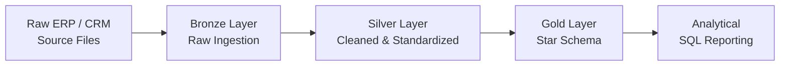

Building data pipelines, data warehouses, and analytics solutions with SQL, Python, and modern data technologies.

 

  

 

 

## 👋 About Me

I'm focused on building practical data solutions across the data engineering and analytics lifecycle — from data ingestion and transformation to modeling, storage, and reporting.

My current work revolves around **SQL, Python, ETL pipelines, data warehousing, data modeling, and analytical systems**. I enjoy taking raw datasets and turning them into structured, reliable, and useful data products.

I'm continuously strengthening my engineering skills through hands-on projects, technical learning, and real-world data problems.

 

## 🛠️ Tech Stack

<table>
<tr>
<td valign="top" width="50%">

**Languages**
 

**Data Engineering & Processing**
 

 

</td>
<td valign="top" width="50%">

**Databases**
 

 

**Analytics**
 

</td>
</tr>
<tr>
<td valign="top" width="50%">

**Tools**
 

</td>
<td valign="top" width="50%">

**Cloud & Data Platforms**
 

 

</td>
</tr>
</table>

 

## 🏗️ Featured Projects

<table>
<tr>
<td width="50%" valign="top">

### 🏗️ Modern Data Warehouse
`SQL Server` `T-SQL` `ETL` `Data Modeling`

Modern data warehouse built using Bronze, Silver, and Gold layers to transform raw ERP and CRM data into structured analytical datasets.

- ETL pipelines for ingestion, cleaning, and transformation
- Star schema with fact and dimension tables
- Data quality checks and analytical SQL reporting

**[→ View Project](https://github.com/Aalokkrsingh/sql-data-warehouse-project)**

</td>
<td width="50%" valign="top">

### 📈 Mutual Fund Analytics Platform
`Python` `SQL` `Pandas` `Power BI / Tableau`

End-to-end financial data platform for consolidating mutual fund data, modeling historical NAV information, and analyzing fund performance and investor behavior.

- ETL pipeline processing **87,000+ records** across 10 public datasets
- **5-table star schema** covering 4.5 years of NAV history
- Risk-adjusted metrics including Sharpe, Sortino, Alpha, and Beta
- Analysis of **32,000+ investor transactions** across 5,000 investors

**[→ View Project](https://github.com/Aalokkrsingh/Bluestock-mf-capstone)**

</td>
</tr>
<tr>
<td width="50%" valign="top">

### ⚡ Advertising Data Analytics using Spark
`Apache Spark` `HDFS` `Scala` `Spark SQL`

Distributed data processing workflow using Apache Spark and Cloudera for advertising data ingestion, transformation, and analytical querying.

- Dataset ingestion through Cloudera HDFS
- RDD processing and conversion into DataFrames
- Analytical queries using Spark SQL
- Aggregation, filtering, sorting, and city-level analysis

**[→ View Project](https://github.com/Aalokkrsingh/Advertising-Data-Analytics-Spark-)**

</td>
<td width="50%" valign="top">

### 🚀 Currently Building

Strengthening my Data Engineering skills through hands-on projects and structured learning:

| Focus Area | Current Work |
|---|---|
| **SQL** | Advanced querying, analytical functions, optimization |
| **Data Engineering** | ETL pipelines, transformation, data quality |
| **Data Warehousing** | Dimensional modeling, star schema design |
| **Apache Spark** | RDDs, DataFrames, Spark SQL |
| **Cloud** | Microsoft Fabric and Azure data workflows |

</td>
</tr>
</table>

 

## 📚 Learning Path

**SQL** → **Data Warehousing** → **ETL / ELT** → **Python** → **Apache Spark** → **Cloud Data Engineering**

 

 

## 💼 Experience

**Data Analyst Intern — Bluestock Fintech** (Remote)
 
*Jun 2026 – Jul 2026*

Worked on financial data workflows involving data cleaning, transformation, exploratory analysis, and business reporting.

- Cleaned and transformed financial datasets using **Python, SQL, and Pandas**
- Built and maintained **Power BI dashboards** for KPI monitoring
- Conducted **exploratory data analysis** to identify patterns and insights
- Documented analytical workflows using **Git and GitHub**

 

## 🏆 Certifications

| Certification | Area |
|---|---|
| **DataCamp Associate Data Engineer Certificate** | Data Engineering |
| **Microsoft Azure AI Fundamentals (AI-900)** | Azure / AI |
| **IBM Big Data Technologies – Spark & Scala Fundamentals** | Big Data / Spark |
| **IBM Data Analysis with Python** | Data Analytics / Python |

 

## 🎓 Education

**K.R. Mangalam University**
 
Bachelor of Computer Applications — Artificial Intelligence & Data Science
 
**2024 – 2027 · CGPA: 7.80**

 

## 📊 GitHub Stats

 

### 📫 Let's Connect

